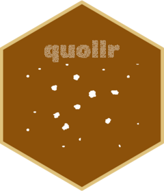

<!-- README.md is generated from README.Rmd. Please edit that file -->

```{r, include = FALSE}
knitr::opts_chunk$set(
  collapse = TRUE,
  comment = "#>",
  fig.path = "man/figures/README-",
  out.width = "100%",
  message = FALSE
)
library(quollr)
```

# quollr: questioning how a high-dimensional object looks in low-dimensions using r 


quollr constructs a model in the 2D space and then lifts to the high dimensional space. The package integrates this model with high dimensional data using the tour technique. For further insights and details, readers can refer to the associated paper available at [link to the paper].

## Installation

You can install the released version of quollr from [CRAN](https://CRAN.R-project.org) with:

``` r
# install.packages("quollr")
```

And the development version from [GitHub](https://github.com/) with:

``` r
# install.packages("remotes")
# remotes::install_github("JayaniLakshika/quollr")
```

## Copyright

This package is licensed under the [MIT license](https://github.com/JayaniLakshika/quollr/LICENSE.md). 

