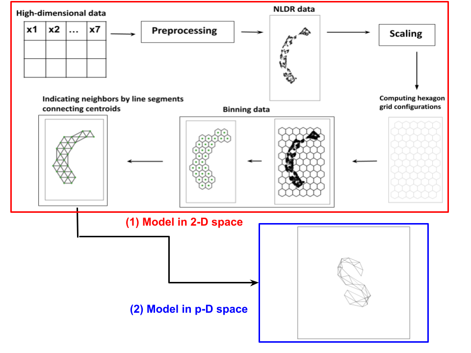

<!-- README.md is generated from README.Rmd. Please edit that file -->

# quollr 

[](https://CRAN.R-project.org/package=quollr)
[](https://cran.r-project.org/package=quollr)

Nonlinear dimension reduction (NLDR) techniques provide a
low-dimensional representation of high-dimensional data by applying a
non-linear transformation. The complexity of the transformations and
data structure can create wildly different representations depending on
the method and parameter choices. It is difficult to determine whether
any are accurate, which is best, or whether they have missed structure.
To help assess the NLDR and decide on which, if any, is best, we have
developed an algorithm to create a model that is then used to display as
a wireframe in high dimensions. The `quollr` package provides functions
to implement the algorithm.

For a thorough background and discussion on this work, please read our
paper <https://arxiv.org/abs/2506.22051>.

## Installation

You can install the released version of `quollr` from
[CRAN](https://CRAN.R-project.org) with:

``` r
install.packages("quollr") 
```

The development version from [GitHub](https://github.com/) with:

``` r
install.packages("pak")
pak::pak("JayaniLakshika/quollr")
```

## Usage

Our approach involves dividing the high-dimensional data set into two
parts: a training set to construct the model and a test set to generate
model summaries. To implement our approach, first we use a 2-D embedding
data set as the initial point. The output of our algorithm is a tour
that displays the model overlaid on high-dimensional data. Our algorithm
comprises two main phases: (1) generate the model in the 2-D space, and
(2) lift the model into high-dimensional space. This methodology is
available in this package.



## About the name

**qu**estioning how a high-dimensional **o**bject **l**ooks in
**l**ow-dimensions using **r**

## Roadmap

- Quick start guide: [1. Quick
  start](https://jayanilakshika.github.io/quollr/articles/quollr1quickstart.html)
- To learn more about the data preprocessing: [2. Data
  preprocessing](https://jayanilakshika.github.io/quollr/articles/quollr2dataprocessing.html)
- To create the full hexagonal grid: [3. Algorithm for binning
  data](https://jayanilakshika.github.io/quollr/articles/quollr3hexbin.html)
- To learn more about the main steps of the algorithm: [4. Algorithm for
  visualising the model overlaid on high-dimensional
  data](https://jayanilakshika.github.io/quollr/articles/quollr4algo.html)
- To generate model summaries: [5. Generating model
  summaries](https://jayanilakshika.github.io/quollr/articles/quollr5summary.html)
- To select the optimal bin width: [6. Selecting the best bin
  width](https://jayanilakshika.github.io/quollr/articles/quollr6bestbinwidth.html)
- To select the most reasonable NLDR layout: [7. Selecting the best
  fit](https://jayanilakshika.github.io/quollr/articles/quollr7bestfit.html)

## Copyright

This package is licensed under the [MIT
license](https://github.com/JayaniLakshika/quollr/tree/main?tab=MIT-2-ov-file).
